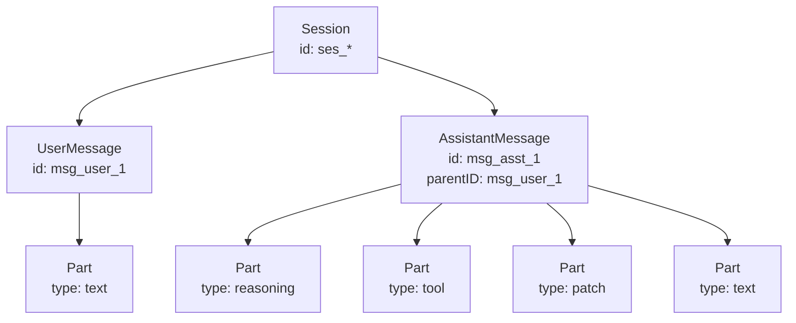

# Session 数据模型

## 1. 这份文档适合谁

这份文档适合第一次接入 Session API 的调用方、前端渲染方和 SDK 维护者。

如果你的问题是：

- `Session`、`Message`、`Part` 是什么关系
- `UserMessage` 和 `AssistantMessage` 有什么区别
- `OutputFormat`、`structured`、`error` 分别是什么

先看这一页。

如果你要查每个字段的精确类型、每种 `Part` 的详细字段和实例，请转到 [Session 数据模型字段参考](./04-session-model-reference.md)。

## 2. Quick Mental Model

- 一个 `Session` 表示一次对话或工作上下文
- 一个 `Session` 包含多条 `Message`
- 一条 `Message` 在 API 中表现为 `info + parts[]`
- `Message.info` 是消息头，描述角色、时间、模型、状态和统计
- `parts[]` 是消息内部的内容片段，`Part.type` 决定片段形状
- `AssistantMessage.parentID` 通常指向它所响应的那条 `UserMessage`

## 3. Session、Message、Part 的关系

高层结构示例：

```json
{
  "info": {
    "id": "msg_asst_1",
    "sessionID": "ses_123",
    "role": "assistant",
    "parentID": "msg_user_1"
  },
  "parts": [
    {
      "id": "prt_1",
      "sessionID": "ses_123",
      "messageID": "msg_asst_1",
      "type": "reasoning",
      "text": "Need to inspect tests first",
      "time": {
        "start": 1742340200100
      }
    },
    {
      "id": "prt_2",
      "sessionID": "ses_123",
      "messageID": "msg_asst_1",
      "type": "tool",
      "callID": "call_1",
      "tool": "read_file",
      "state": {
        "status": "completed",
        "input": {
          "path": "src/index.ts"
        },
        "output": "Read 120 lines",
        "title": "Read file",
        "metadata": {},
        "time": {
          "start": 1742340200200,
          "end": 1742340200400
        }
      }
    },
    {
      "id": "prt_3",
      "sessionID": "ses_123",
      "messageID": "msg_asst_1",
      "type": "text",
      "text": "I fixed the tests."
    }
  ]
}
```

关系示意：



可以把它理解成：

- `Session` 是容器
- `Message` 是消息级元信息
- `Part` 是消息内真正承载内容和过程的片段

## 4. UserMessage vs AssistantMessage

| 维度 | `UserMessage` | `AssistantMessage` |
| --- | --- | --- |
| 角色 | `role = "user"` | `role = "assistant"` |
| 模型信息 | `model.providerID`, `model.modelID` | `providerID`, `modelID` |
| 关系字段 | 无 `parentID` | 用 `parentID` 关联对应用户消息 |
| 关键上下文 | `agent`, `system`, `format`, `tools` | `agent`, `path`, `mode`, `variant` |
| 生命周期字段 | `time.created` | `time.created`, `time.completed`, `finish`, `error` |
| 成本统计 | 无 | `cost`, `tokens` |
| 结构化结果 | 不返回 | 可能返回 `structured` |

## 5. Part 与角色关系

结论先行：

- 同一种 `Part.type` 不因 `user` / `assistant` 改变字段结构
- 角色差异主要体现在常见出现位置和语义用途

常见出现模式：

| 角色 | 常见 `Part.type` |
| --- | --- |
| `user` | `text`, `file`, `agent`, `subtask` |
| `assistant` | `reasoning`, `tool`, `patch`, `snapshot`, `step-start`, `step-finish`, `retry`, `compaction`, `text` |

这只是常见模式，不是强约束。真正稳定的契约是 `type` 对应的字段结构。

## 6. OutputFormat、structured、error

`OutputFormat`、`structured`、`error` 解决的是“我希望模型怎么输出”和“模型最后有没有按这个格式输出”。

- `UserMessage.format` 是请求侧要求
- `AssistantMessage.structured` 是结构化输出成功时的结果
- `AssistantMessage.error` 可能包含 `StructuredOutputError`

一句话记忆：

- `OutputFormat` = 输出要求
- `structured` = 成功产物
- `error` = 失败或中止信号

如果你只需要自然语言正文，通常读取 `parts` 里的 `text` 即可。  
如果你要求结构化输出，优先读取 `structured`，失败时检查 `error`。

## 7. Message 生命周期

典型流程是：

1. 创建一条 `UserMessage`
2. 创建一条 `AssistantMessage`，并通过 `parentID` 指向对应 user message
3. assistant 生成过程中，`parts[]` 会逐步累积
4. 完成时写入 `time.completed`，并可能带 `finish`
5. 失败或中止时，通常通过 `error` 表达原因

这意味着：

- 正在生成的消息可能只有部分 `parts`
- `time.completed` 缺失通常表示消息尚未完成
- `finish` 更像完成原因，`error` 更像异常原因

## 8. 渲染建议

- 会话列表优先读 `Session.title` 和 `Session.time.updated`
- 消息列表优先读 `Message.info.role`、`time`、`agent`
- 自然语言正文优先渲染 `TextPart`
- 工具过程优先渲染 `ToolPart`
- 代码修改摘要优先渲染 `PatchPart`
- 推理过程优先渲染 `ReasoningPart`
- 结构化结果优先读 `AssistantMessage.structured`
- 失败状态优先读 `AssistantMessage.error`

## 9. 下一步看哪里

- 想看接口路径、参数和 `curl`：回到 [Session 接口](./03-session-apis.md)
- 想查每个字段的精确类型和实例：看 [Session 数据模型字段参考](./04-session-model-reference.md)
