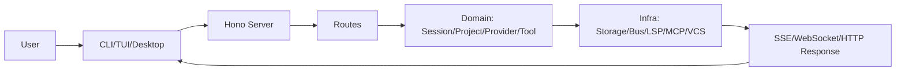
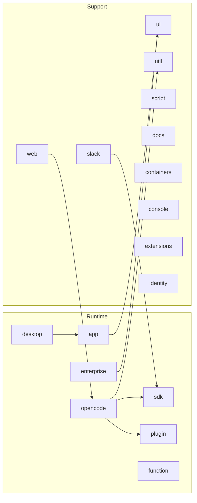

# OpenCode 总览（`packages/opencode` 专项）/ OpenCode Overview (`packages/opencode` Focus)

> 本文档聚焦 `packages/opencode` 包架构，原有历史梳理内容保留，并增补跨 package 导航。

## 系统边界 / System Boundaries

OpenCode 是一个以 CLI/TUI 为核心交互层、以本地 server 为能力中枢（capability hub）的 AI coding agent 系统。

- 客户端层（Client Layer）: CLI、TUI、Desktop/Web clients。
- 服务层（Service Layer）: Hono-based server routes + SSE + WebSocket。
- 核心域层（Domain Layer）: session、project、provider、tool、permission、question。
- 基础设施层（Infra Layer）: storage、bus、lsp、mcp、vcs。

证据 / Evidence:

- `packages/opencode/src/index.ts`
- `packages/opencode/src/server/server.ts`
- `packages/opencode/src/server/routes/*`
- `packages/opencode/src/bus/*`

## 核心模块 / Core Modules

1. CLI Command Router
   - 入口：`packages/opencode/src/index.ts`
   - 功能：注册命令、处理全局日志与错误。
2. Server API
   - 入口：`packages/opencode/src/server/server.ts`
   - 功能：鉴权、CORS、目录上下文注入、路由挂载。
3. Session Runtime
   - 入口：`packages/opencode/src/server/routes/session.ts`
   - 功能：会话生命周期、消息流、回滚/总结/分享。
4. Tooling Surface
   - 入口：`packages/opencode/src/server/routes/file.ts`, `.../mcp.ts`, `.../tui.ts`
   - 功能：文件与符号检索、MCP 管理、TUI 远程控制。

## 运行模式 / Runtime Modes

- 本地 CLI 模式（Local CLI Mode）
  - 用户直接运行 `opencode ...` 命令。
- Server 模式（Server Mode）
  - 通过 REST/SSE/WebSocket 提供能力。
- 多客户端模式（Multi-Client Mode）
  - 同一 server 可同时服务 TUI、Desktop、Web。

证据 / Evidence:

- `packages/opencode/src/cli/cmd/serve`
- `packages/opencode/src/server/routes/pty.ts`（WebSocket）
- `packages/opencode/src/server/routes/global.ts` + `packages/opencode/src/server/server.ts`（SSE）

## 全链路总图 / End-to-End Flow

## Packages 全景 / Packages Panorama

分组说明 / Grouping:

1. 核心链路：`opencode/app/desktop/enterprise/function/sdk/plugin`
2. 支撑链路：`ui/util/slack/script/containers/console/web/docs/extensions/identity`
3. 分包详解见：[`../packages/index.md`](../packages/index.md)

## 阅读顺序 / Suggested Reading Order

1. [`00-exploration-task.md`](./00-exploration-task.md)
2. [`02-system-design.md`](./02-system-design.md)
3. [`03-implementation-map.md`](./03-implementation-map.md)
4. [`../api/01-rest-reference.md`](../api/01-rest-reference.md)
5. [`../api/02-sse-reference.md`](../api/02-sse-reference.md)
6. [`glossary.md`](./glossary.md)
7. [`../packages/index.md`](../packages/index.md)
