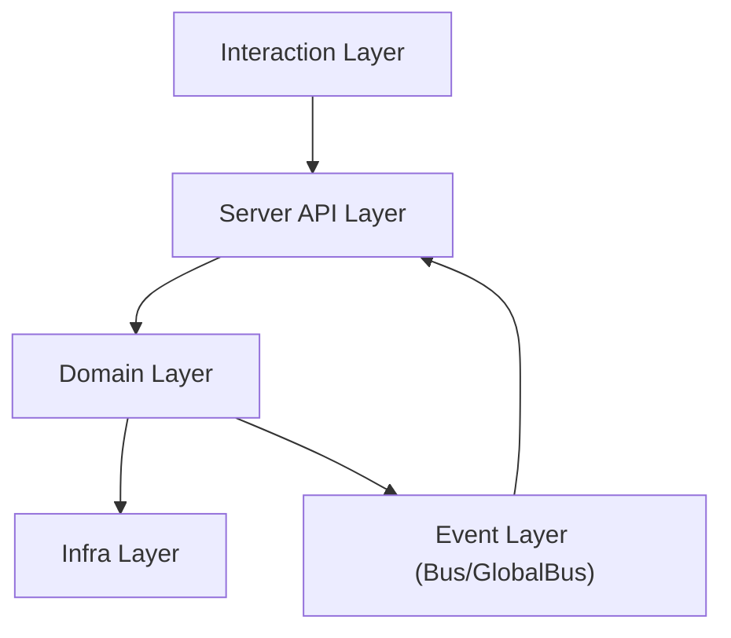

# 系统设计 / System Design

## 1. 模块关系 / Module Relationships

OpenCode 的核心依赖方向如下：

- Interaction (`cli`, `tui`, desktop/web clients)
- API surface (`server`, `routes`)
- Domain (`session`, `project`, `provider`, `tool`, `permission`, `question`)
- Infra (`storage`, `bus`, `lsp`, `mcp`, `vcs`, `worktree`)

证据 / Evidence:

- `packages/opencode/src/index.ts`
- `packages/opencode/src/server/server.ts`
- `packages/opencode/src/server/routes/session.ts`
- `packages/opencode/src/bus/index.ts`

## 2. API 入口与中间件链 / API Entry and Middleware Chain

`Server.App()` 负责统一中间件和路由挂载。

典型链路：

1. `onError` 全局错误转换。
2. `basicAuth`（可选）基础认证。
3. 请求日志与计时。
4. CORS 白名单策略。
5. `Instance.provide` 注入目录上下文（directory context）。
6. 路由分发（`/project`, `/session`, `/mcp`, `/tui`...）。

证据 / Evidence:

- `packages/opencode/src/server/server.ts` (`Server.App`)

## 3. 数据与状态流 / Data and State Flow

### 3.1 Session Flow

- 输入：`POST /session/{sessionID}/message|command|shell`
- 处理：session runtime + provider/tool orchestration
- 输出：消息记录、状态更新、事件发布

证据 / Evidence:

- `packages/opencode/src/server/routes/session.ts`
- `packages/opencode/src/session/*`

### 3.2 Tool/File Flow

- 输入：`GET /find`, `GET /file/content`, `GET /find/symbol`
- 处理：文件系统读取 + LSP 查询
- 输出：结构化搜索结果/内容结果

证据 / Evidence:

- `packages/opencode/src/server/routes/file.ts`
- `packages/opencode/src/lsp/*`

### 3.3 PTY Flow

- 输入：`POST /pty`, `GET /pty/{ptyID}/connect`
- 处理：pty session lifecycle + websocket forwarding
- 输出：terminal I/O stream

证据 / Evidence:

- `packages/opencode/src/server/routes/pty.ts`

## 4. 事件模型 / Event Model

- 实例级事件：`/event`
- 全局事件：`/global/event`
- 事件骨架：
  - Instance: `{ type, properties }`
  - Global: `{ directory, payload: { type, properties } }`

证据 / Evidence:

- `packages/opencode/src/server/server.ts` (`GET /event`)
- `packages/opencode/src/server/routes/global.ts` (`GET /global/event`)
- `packages/opencode/src/bus/index.ts`
- `packages/opencode/src/bus/global.ts`

## 5. 设计约束 / Design Constraints

1. Provider-agnostic：模型提供商可替换。
2. Context-bound：所有请求可绑定到目录上下文。
3. Event-driven：实时能力通过 SSE + Bus 实现。
4. Extensible routes：按 domain 拆分路由文件。

## 6. 与下层文档关系 / Relationship to Lower Layers

- 实现细节见 [`03-implementation-map.md`](./03-implementation-map.md)
- REST 接口见 [`../api/01-rest-reference.md`](../api/01-rest-reference.md)
- SSE 接口见 [`../api/02-sse-reference.md`](../api/02-sse-reference.md)
