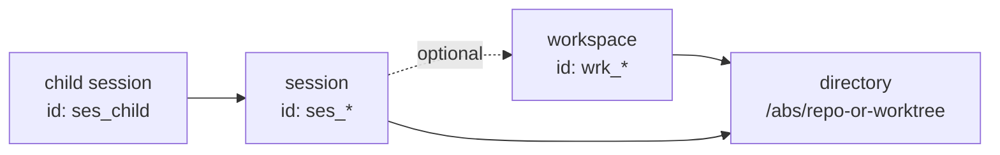

# 上下文模型：workspace、directory 与 session

> 本文档回答 OpenCode 调用方最常见的判断题：`workspace`、`directory`、`session`、`child session` 分别是什么，它们如何关联，插件默认 client 和 server REST 分别能直接使用哪些能力。

## Quick Answers

- `directory` 是实际工作的文件系统目录。
- `workspace` 是控制面对象，通常会关联一个 `directory`。
- `session` 会持久化保存自己的 `directory`，并可能保存 `workspaceID`。
- `child session` 是会话派生关系，不是新的目录概念。
- `subsession` 不是当前实现里的正式 API 术语；本文统一使用 `child session` 或 `forked session`。
- 插件默认 client 可靠依赖 `directory`，不应默认把 `workspace` 当作稳定能力。
- server 的多数实例级接口支持 `workspace` 和 `directory` 两种上下文入口。
- 只拿 `sessionId` 通常足够做读操作；继续执行会话时，不应默认忽略当前请求上下文。

## Core Concepts

### `directory`

`directory` 是实际工作的目录路径。运行时实例按目录初始化和复用。

最小例子：

```bash
curl -s 'http://localhost:4096/session?directory=%2Fabs%2Frepo'
```

为什么这样工作：
这个请求直接把实例上下文绑定到 `/abs/repo`，后续路由会在该目录对应的实例里执行。

### `workspace`

`workspace` 是控制面里的逻辑对象。它有自己的 `id`、`type`、`branch`、`directory`、`projectID`。当前内置类型里，`worktree` 会为 workspace 生成一个实际目录。

最小例子：

```json
{
  "id": "wrk_123",
  "type": "worktree",
  "branch": "codex/doc-reorg",
  "directory": "/Users/zy/Code/opencode/opencode-worktrees/doc-reorg",
  "projectID": "prj_123"
}
```

为什么这样工作：
`workspace` 不是运行时目录本身，而是一个指向目录的管理对象。调用方传 `workspace` 时，server 会先找到它，再落到对应目录。

### `session`

`session` 是会话记录。它保存会话自己的 `id`、`directory`、可选的 `workspaceID`、以及消息和派生关系。

最小例子：

```json
{
  "id": "ses_123",
  "workspaceID": "wrk_123",
  "directory": "/abs/repo",
  "parentID": null,
  "title": "plugin demo"
}
```

为什么这样工作：
创建 session 时，当前请求上下文里的 `directory` 会写入 session；如果当前请求还带了 `workspace`，对应的 `workspaceID` 也会一起保存。

### `child session`

`child session` 是从父会话 fork 出来的子会话。它表达的是会话关系，不单独表达目录或 workspace。

最小例子：

```text
parent session: ses_root
child session:  ses_child
relationship:   ses_child.parentID = ses_root
```

为什么这样工作：
`child session` 的核心语义是“从哪条会话派生”，而不是“在哪个新目录里运行”。是否处于新目录，取决于当前请求上下文，而不是 `child session` 这个名词本身。

## How They Relate

可以把四者关系记成这三条：

- `workspace -> directory`
- `session -> directory (+ optional workspaceID)`
- `child session -> parent session`

关系图：



这里最容易混淆的是：

- `workspace` 和 `directory` 不是同层概念。
- `session` 不等于目录；它只是保存并引用目录上下文。
- `child session` 不等于新的 `workspace`，也不自动等于新的 `directory`。

## Capability Boundaries

### 能力矩阵

| 对象/层 | 可显式指定 `directory` | 可显式指定 `workspace` | 持久化保存上下文 | 备注 |
| --- | --- | --- | --- | --- |
| 插件默认 client | 是，且默认已注入 | 不应默认假设 | 否 | 当前 runtime 注入的是默认 v1 client |
| Server REST | 是 | 是 | 否 | 多数实例级接口通过请求上下文解析 |
| `session` 记录 | 否 | 否 | 是 | 保存 `directory`，并可能保存 `workspaceID` |
| `child session` 关系 | 否 | 否 | 是 | 保存 `parentID`，不单独代表目录或 workspace |

### 插件默认 client

插件 runtime 创建 client 时，会把当前 `Instance.directory` 注入到请求上下文里。

最小例子：

```ts
const ses = await input.client.session.create({
  body: { title: "plugin demo" },
})
```

为什么这样工作：
插件默认 client 已经携带当前目录，所以这个调用即使不显式传 `query.directory`，也会在当前插件实例目录里创建 session。

插件侧应把这些点视为稳定基线：

- `session.*` 可以直接使用。
- `directory` 是默认可靠的上下文入口。
- `workspace` / `worktree` 等能力在更底层或 v2 中更完整，但当前默认插件 client 不应默认假设存在同等保证。

### Server REST

server 多数实例级接口支持两种上下文入口，并按固定优先级解析：

1. Query: `workspace`
2. Header: `x-opencode-workspace`
3. Query: `directory`
4. Header: `x-opencode-directory`
5. `process.cwd()`

最小例子 1：按 `directory` 创建 session

```bash
curl -s \
  -X POST \
  'http://localhost:4096/session?directory=%2Fabs%2Frepo' \
  -H 'content-type: application/json' \
  -d '{"title":"server demo"}'
```

为什么这样工作：
请求直接指定了工作目录，所以新 session 会绑定到这个目录。

最小例子 2：按 `workspace` 调用 session API

```bash
curl -s \
  'http://localhost:4096/session?workspace=wrk_123'
```

为什么这样工作：
server 会先解析 `workspace`，再把请求路由到该 workspace 对应的目录上下文。

## Common Scenarios

### 创建 session 时不传上下文，会怎样

在插件默认 client 场景下，通常仍然会落到当前插件实例目录，因为 runtime 已经自动注入 `directory`。

在直接调 server REST 的场景下，如果你没有显式传 `workspace` 或 `directory`，server 会退回到服务进程的 `process.cwd()`。

### 插件里能不能指定 `workspace`

从底层 server 能力看，请求上下文支持 `workspace`。但从当前默认插件 client 文档口径看，`workspace` 不应当作插件侧稳定能力来依赖。

如果你的插件只是运行在当前项目上下文中，优先依赖默认注入的 `directory`。

### server 调用时同时传了 `workspace` 和 `directory`，会怎样

以 `workspace` 为准。

这是因为 server 的上下文解析优先级先看 `workspace`，再看 `directory`。

### 后续调用只有 `sessionId` 是否足够

如果你只是读取会话或消息，通常足够：

- `GET /session/{sessionID}`
- `GET /session/{sessionID}/message`

如果你要继续执行会话，例如再发一条 prompt，不应默认只靠 `sessionId`：

- `SessionPrompt` 会先读取 `session`
- 但执行过程仍依赖当前请求绑定的实例上下文，例如 `Instance.directory`

最安全的实践是：

- 插件里继续沿用默认 `input.client`
- 跨上下文调用时继续显式传 `directory`
- 不要把“能按 `sessionId` 查到记录”理解成“任何继续执行都不需要上下文”

### `child session` 是否代表新的 workspace 或新的目录

不代表。

`child session` 只说明它来自哪个父会话。它是否运行在新目录，取决于你 fork 时所在的请求上下文，而不是 `child session` 这个关系本身。

## Further Reading

- REST 上下文选择：[../api/01-rest-reference.md](../api/01-rest-reference.md)
- Session 接口与字段：[../api/rest/03-session-apis.md](../api/rest/03-session-apis.md)
- Plugin SDK 总览：[../api/plugin-sdk/04-sdk-overview.md](../api/plugin-sdk/04-sdk-overview.md)
- Plugin 中的 `session.*` 用法：[../api/plugin-sdk/05-session-and-message.md](../api/plugin-sdk/05-session-and-message.md)

## Evidence

- `packages/opencode/src/server/server.ts`
- `packages/opencode/src/plugin/index.ts`
- `packages/opencode/src/session/index.ts`
- `packages/opencode/src/session/prompt.ts`
- `packages/opencode/src/control-plane/adaptors/worktree.ts`
