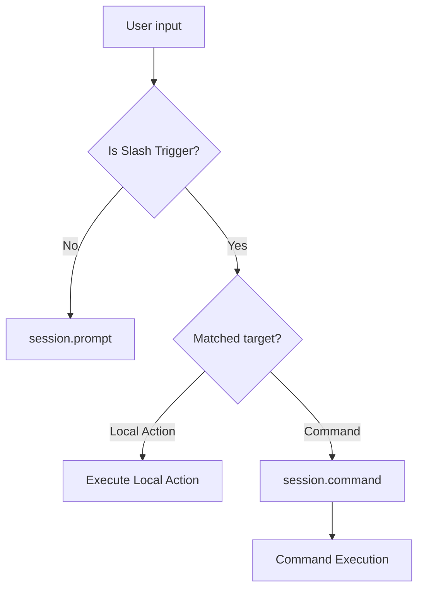
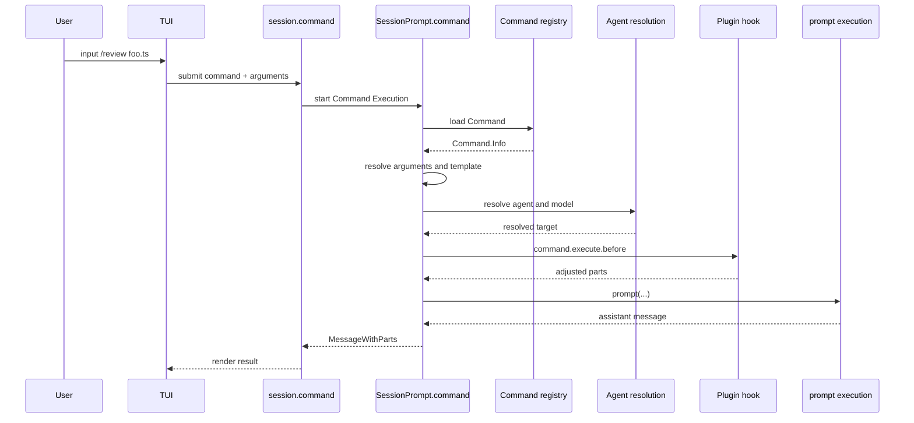

# OpenCode Command 机制说明（TUI 触发视角）

本文从开发者阅读 TUI 实现的视角，说明 OpenCode 中的 Command 机制。重点回答四个问题：

1. TUI 中输入 `/xxx` 时，系统如何分流
2. 什么属于 Command，什么属于 Local Action
3. Command 的来源边界在哪里
4. 一次 Command Execution 从 TUI 到服务端是如何完成的

## 1. Command 在 OpenCode 中是什么

在 OpenCode 里，Command 不是 shell command，也不只是静态的一段提示词。  
更准确地说，Command 是一次可复用的调用规格：它用模板定义“要做什么”，并可附带默认的执行参数，例如 `agent`、`model` 和 `subtask`。

一个 Command 至少包含：

- 命令名
- 一段模板文本
- 可选的默认 agent
- 可选的默认 model
- 可选的来源标记

这些定义在运行时统一收敛为 `Command.Info`。从实现角度看，Command 本身不直接执行，它的职责是为一次 Command Execution 提供模板和执行默认值。

可以把它理解成：

```ts
type CommandInfo = {
  name: string
  description?: string
  agent?: string
  model?: string
  source?: "command" | "mcp" | "skill"
  template: string | Promise<string>
  subtask?: boolean
  hints: string[]
}
```

这里最重要的字段语义是：

- `name`
  - 对应 `/review` 里的 `review`
- `template`
  - 定义这次任务的模板内容
- `agent`
  - 命令默认使用的 agent
- `model`
  - 命令默认使用的模型
- `source`
  - 命令来自哪里
- `subtask`
  - 是否倾向于作为子任务执行
- `hints`
  - 模板里提取出的 `$1`、`$ARGUMENTS` 等占位提示

从职责划分上看：

- `Command`
  - 决定“做什么”
- `Agent`
  - 决定“由谁做”
- `Model`
  - 决定“用什么推理引擎做”

在运行时，Command 会先完成参数替换和模板展开。普通情况下，展开后的结果会形成一段具体的任务提示词，并作为用户消息内容进入模型；如果这是一个 `subtask` Command，这段内容会先被包装成 `subtask part`，再继续进入 agent 调度链路。

一个最小的 User-defined Command 例子如下：

```md
---
description: Run tests and summarize failures
agent: build
---

Run the test suite in $ARGUMENTS.
Summarize the failures and propose fixes.
```

如果这个文件定义在 `.opencode/commands/test.md` 中，那么用户在 TUI 输入：

```text
/test packages/opencode
```

运行时会先把 `$ARGUMENTS` 替换为 `packages/opencode`，得到大致这样的任务提示词：

```text
Run the test suite in packages/opencode.
Summarize the failures and propose fixes.
```

然后这次执行会按下面的职责分工继续进行：

- `Command`
  - 提供这段任务模板
- `agent: build`
  - 指定由哪个 agent 执行
- `model`
  - 如果 Command 没有显式指定，就按当前会话或 agent 的默认值决议

## 2. TUI 中的 command 入口与分流

从 TUI 视角看，用户最先接触到的统一表象是 Slash Trigger，也就是输入 `/xxx`。  
`/xxx` 只是触发形式，不是运行时分类。真正的运行时分类只有两类：

1. `Local Action`
2. `Command`

也就是说，用户虽然看到的都是 `/xxx`，但它们背后可能走两条完全不同的链路：

- Slash Trigger -> Local Action
- Slash Trigger -> Command -> `session.command` -> Command Execution

另外，如果输入不是 slash 命令，或者没有命中 slash 分流规则，那么它就是普通提示词，走 `session.prompt`。

对应关系可以先用下面这张图理解：



### 2.1 TUI 中可见的 command 入口

TUI 中用户能看到的 `/xxx` 候选，来自两部分：

1. TUI 本地显式注册的 slash 候选
2. 运行时返回的 Command 列表

前者来自 TUI 各处的 `command.register(...)` 注册。它们通常是界面级功能，例如打开对话框、切换状态、调用某个 session API。  
后者来自运行时 `sync.data.command`，本质上是服务端 `GET /command` 返回的 Command 列表。

这两个集合都会显示成 `/xxx`，但它们不是一类东西：

- TUI 本地显式注册的 slash 候选，大多数落到 `Local Action`
- 运行时 Command 列表中的 slash 候选，落到 `Command Execution`

### 2.2 触发 Local Action 的入口

从当前实现看，TUI 中显式注册的大多数 Slash Trigger 都属于 `Local Action`。

#### 会话与导航

- `/sessions`
- `/resume`
- `/continue`
- `/new`
- `/clear`

这些入口都属于 Local Action，主要用于会话切换或导航。

#### Agent、Provider 与系统界面

- `/models`
- `/agents`
- `/mcps`
- `/connect`
- `/status`
- `/themes`
- `/help`
- `/exit`
- `/quit`
- `/q`

这些入口都属于 Local Action，主要用于打开对话框、切换系统视图或退出程序。

#### 会话操作

- `/share`
- `/rename`
- `/timeline`
- `/fork`
- `/compact`
- `/summarize`
- `/unshare`
- `/undo`
- `/redo`
- `/timestamps`
- `/toggle-timestamps`
- `/thinking`
- `/toggle-thinking`
- `/copy`
- `/export`

这些入口也属于 Local Action，但其中一部分会调用其他 session API：

- `/share` -> `session.share`
- `/compact` -> `session.summarize`
- `/undo` -> `session.revert`
- `/redo` -> `session.revert` 或 `session.unrevert`
- `/unshare` -> `session.unshare`

#### 输入辅助

- `/editor`
- `/skills`

这些入口属于 Local Action，用于编辑输入内容或选择 skill。

这类入口的共同特点是：

- 不进入 `session.command`
- 不查 `Command.get()`
- 不进入 `SessionPrompt.command()`
- 不进入 Command Execution

### 2.3 触发 Command Execution 的入口

触发 Command Execution 的 Slash Trigger 不由 TUI 硬编码维护，而是来自运行时 `sync.data.command`。

这类入口提交后的共同特征是：

1. 命令名来自 Command 列表
2. TUI 提交时调用 `session.command`
3. 服务端进入 `SessionPrompt.command()`
4. 最终走完整的 Command Execution

从 TUI 角度看，这部分 Slash Trigger 不是硬编码在本地 slash 表里，而是由运行时 Command 列表动态提供。

### 2.4 这些 Command 从哪里来

进入 Command Execution 的 Command 只有四类来源，且它们都属于 Command 体系：

#### 2.4.1 Builtin Command

Builtin Command 由 OpenCode 运行时直接内建。目前最典型的是：

- `/init`
- `/review`

它们不是 TUI 本地动作，而是服务端内建的命令模板。

#### 2.4.2 User-defined Command

User-defined Command 由用户配置提供，来源有两种：

1. `opencode.json` 中的 `command`
2. `.opencode/commands/*.md`

这类 Command 会被加载进统一的 Command 列表，并以 Slash Trigger 的形式在 TUI 中可用。

#### 2.4.3 Skill-backed Command

skill 会被运行时收集，并映射为可调用的 Command。  
这类 Command 的来源是 skill，但执行上仍然走 Command Execution。

这里的映射规则很直接：只要某个 skill 能被运行时扫描并成功加载进 `Skill.all()`，它就会按自己的 `name` 进入 Command 列表。换句话说，能被映射成 Command 的不是“某一类特殊 skill”，而是“所有被成功加载的 skill”。

一个 skill 至少要满足两点：

1. frontmatter 中有 `name`
2. frontmatter 中有 `description`

正文内容会作为这个 Command 的模板内容使用。因此，一个最小的 skill 例子本质上就已经是一个可映射的 Command：

```md
---
name: docs-writer
description: Write or revise documentation
---

Update the documentation for $ARGUMENTS.
Focus on user-facing behavior and examples.
```

不过这里有一个当前实现上的细节：skill-backed Command 虽然会进入运行时 Command 列表并且可以执行，但 TUI 的 slash 自动补全当前会显式过滤 `source === "skill"` 的项，所以它不会像 `/review` 那样直接出现在 `/` 候选列表里。用户通常通过 `/skills` 这个 Local Action 打开弹框，再把选中的 skill 名称插入输入框。

例如，用户通过 `/skills` 选择 `docs-writer` 后，输入框会变成：

```text
/docs-writer docs/architecture/07-command.md
```

或者也可以手动输入同样的内容。提交后，这次触发的归属仍然是：

- Slash Trigger -> Command -> Command Execution

而不是 Local Action。也就是说，`/skills` 本身是 Local Action，但它插入的 `/<skill-name>` 最终触发的是 skill-backed Command。

#### 2.4.4 MCP-backed Command

MCP prompt 也会被映射为可调用的 Command。  
这类 Command 的来源是 MCP prompt，但执行上仍然走 Command Execution。

这里的映射规则同样是运行时自动完成的：只要某个 MCP server 暴露了 prompt，并且它出现在 `MCP.prompts()` 返回的清单里，这个 prompt 就会按自己的名字进入 Command 列表。

对于带参数的 MCP prompt，运行时会把 prompt 的参数位自动改写成 `$1`、`$2` 这样的占位形式，再交给 Command Execution 去替换。因此，一个名为 `release-notes`、带一个版本参数的 MCP prompt，在 TUI 里会表现成可以直接输入：

```text
/release-notes v1.2.3
```

从开发者视角看，这个例子的重要点不是 prompt 文本长什么样，而是它的进入条件：

1. MCP server 提供了一个 prompt
2. 这个 prompt 被运行时枚举到
3. 它就会成为一个 MCP-backed Command

因此，MCP-backed Command 也不是 TUI 单独声明出来的，而是 MCP prompt 被运行时投影到 Command 列表后的结果。

这里要特别注意：

- `Builtin Command / User-defined Command / Skill-backed Command / MCP-backed Command` 都属于 `Command`
- 它们与 `Local Action` 是不同集合
- 它们可能都表现为 `/xxx`，但 `/xxx` 只是 Slash Trigger，不决定运行时归属

## 3. Command Execution 的关键输入

一次 Command Execution 在 TUI 提交时，核心输入可以抽象成：

```ts
type CommandInput = {
  command: string
  arguments: string
  agent?: string
  model?: string
  variant?: string
  parts?: unknown[]
  sessionID: string
  messageID?: string
}
```

这里最重要的字段是：

- `command`
  - 命令名
- `arguments`
  - 用户在 `/xxx` 后输入的参数文本
- `agent`
  - 当前 TUI 选中的 agent，除非命令自身覆盖
- `model`
  - 当前 TUI 选中的 model，除非命令自身覆盖
- `parts`
  - 文件等附加上下文

## 4. Command Execution 的服务端链路

一旦 TUI 调用 `session.command`，服务端会进入统一的 Command Execution 链路。主流程如下：

1. 根据命令名读取 Command 定义
2. 解析参数
3. 替换 `$1`、`$2`、`$ARGUMENTS`
4. 处理模板中的 shell 注入
5. 决定最终的 agent 和 model
6. 构造要送入推理链路的 parts
7. 必要时包装为 subtask
8. 触发 plugin hook
9. 调用统一的 `prompt(...)`
10. 返回 assistant message

这张时序图从 TUI 出发描述了这条链路：



## 5. 插件与 Command 的关系

插件当前不会直接注册一条 TUI 本地 Slash Trigger。  
插件对 Command 的影响更接近“影响 Command Execution 的内容”或“扩展 Command 的来源”。

主要方式有三种：

1. 提供 tool 给 agent 使用
2. 通过 `command.execute.before` 修改命令上下文
3. 通过 MCP prompt 或 skill 间接进入 Command 列表

因此，从架构边界看：

- TUI 本地显式注册的 slash 表，主要对应 Local Action
- 插件主要影响 Command 体系，而不是直接扩展 TUI 本地 Slash Trigger

## 6. 总结

从 TUI 触发视角看，OpenCode 只有两类核心运行时能力：

1. `Command`
2. `Local Action`

`/xxx` 只是 Slash Trigger。  
用户看到的 slash 入口虽然形式一致，但背后可能走两条完全不同的链路：

- Slash Trigger -> Local Action
- Slash Trigger -> Command -> `session.command` -> Command Execution

理解这条边界之后，再阅读 TUI、Command registry 和 `SessionPrompt.command()` 的实现，会更容易把系统结构看清楚。

## 关键术语说明

- `Command`
  - OpenCode 的命令模板对象，对应 `Command.Info`
- `Builtin Command`
  - 运行时内建的 Command，例如 `init`、`review`
- `User-defined Command`
  - 用户通过 `opencode.json` 或 `.opencode/commands/*.md` 定义的 Command
- `Skill-backed Command`
  - 由 skill 映射进入 Command 列表的 Command
- `MCP-backed Command`
  - 由 MCP prompt 映射进入 Command 列表的 Command
- `Local Action`
  - 由 TUI 本地直接执行的动作，可能是 UI 操作，也可能调用其他 session API
- `Slash Trigger`
  - TUI 提供的 `/xxx` 触发形式，本身不是分类
- `Command Execution`
  - 命中某个 Command 后，经 `session.command -> SessionPrompt.command()` 进入 agent 执行链路的过程

## Evidence

1. `packages/opencode/src/command/index.ts`
2. `packages/opencode/src/session/prompt.ts`
3. `packages/opencode/src/config/config.ts`
4. `packages/opencode/src/server/server.ts`
5. `packages/opencode/src/server/routes/session.ts`
6. `packages/opencode/src/cli/cmd/tui/app.tsx`
7. `packages/opencode/src/cli/cmd/tui/routes/session/index.tsx`
8. `packages/opencode/src/cli/cmd/tui/component/prompt/index.tsx`
9. `packages/opencode/src/cli/cmd/tui/component/dialog-command.tsx`
10. `packages/plugin/src/index.ts`
